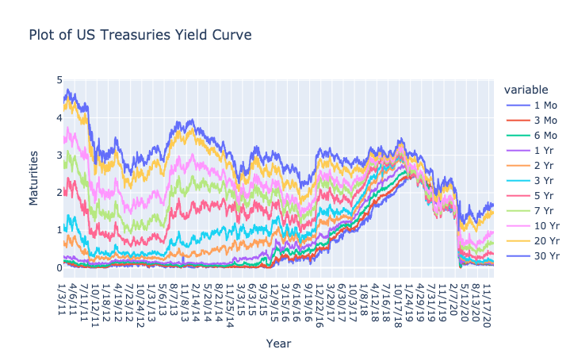
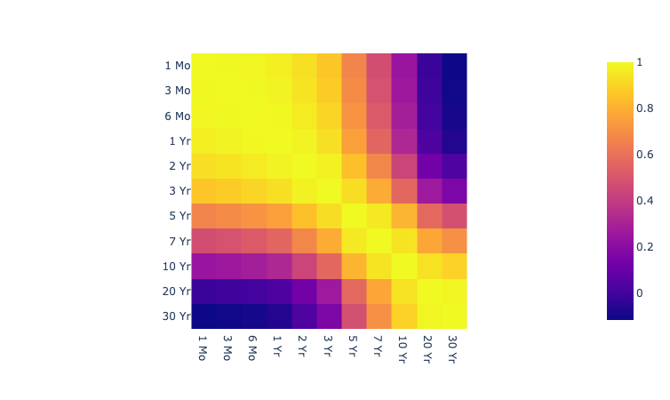
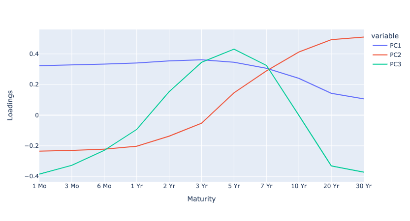
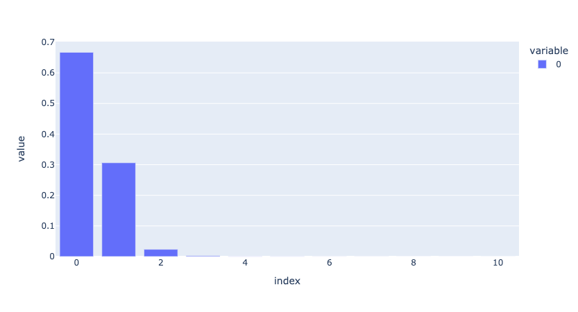

##  Appling Principal Components Analysis on the Interest Rate Term Structure.

Essentially, term structure of interest rates is the relationship between interest rates or bond yields and different terms or maturities. When graphed, the term structure of interest rates is known as a yield curve, and it plays a crucial role in identifying the current state of an economy. (Investopedia)

### PCA

Principal Component Analysis (PCA) technique is used to reduce the dimensionality of a data set, finding the causes of variability and sorting them by importance. Its general objective is extract signal from data by finding the least amount of variables that explain the largest proportion of the data making it easier to interpret.

### Yield Curve

The yield curve shows the interest rates the government must pay to borrow money across different maturites.
According to the expectations theory of interest rates, the yield curve is made up of two aspects:
- An average of market expectations concerning future short-term interest rates.
- The term premium — the extra compensation an investor receives for holding a
longer-term bond. This is essentially because of the time value of money — $100 is worth more today than it is worth tomorrow, due to its potential earning capacity due to interest. Therefore, for a fixed-income investment to be worth the extra time the investor must part with their cash, the bond issuer must pay the investor some extra amount.

### Project Objective

- To model the yield curve dynamics to identify the fundamental yield curve movements. 
- To determine the number of principal components required to sufficiently explain the yield curve for ...  data.

To illustrate PCA on interest rates movements, we consider the multivariate time series of daily [U.S. Treasury Interest Rate](https://home.treasury.gov/policy-issues/financing-the-government/interest-rate-statistics?data=yield) over a 10-year period from 2011 to 2020.

From the figure above, we can observe that interest rates of similar maturities move closely, i.e. they are highly correlated. 

For this analysis I will use various US Treasuries Interest rates data from 0.5 years up to 30 years to maturity. When finding the principal components of the yield curve, usually[cite](https://www.amazon.ca/Options-Futures-Other-Derivatives-9th/dp/0133456315):
- The first principal component captures *parallel shift* 
- The second principal component captures *a change in slope(or tilt)* $\approx$ term premium
- The third principal component records *curvature or convexity*

The figure below illustrates the first three eigenvectors resulting from singular value decomposition of interest rate changes. In blue, the first eigenvector(or principal component) is approximately a parallel line as it corresponds to a roughly parallel shift in the yield curve. A parallel shift in the yield curve occurs when interest rates across all maturities change by the same number of basis points. In red, the second eigenvector (or principal component) explains movements (or change of slope) of the yield curve. Rates with maturities 1-month and 1-year move in one direction and rates with maturities 20-year and 30-year move in a different direction. The third principal component has a concave shape instead of convex. This is refered to as negative convexity [cite](https://www.investopedia.com/terms/n/negative_convexity.asp#:~:text=What%20Is%20Negative%20Convexity%3F,with%20respect%20to%20its%20yield.).

 

#### PCA computation

The classic approach to PCA is to perform the eigendecomposition on the covariance matrix $\sum$ , which is a $d \times d$ (where d represents the dimensions of the dataset) matrix where each element represents the covariance between two features. The covariance between two features is calculated as follows:
$$\sigma_{jk} = \frac{1}{n-1} \sum_{i=1}^{n}(x_{ij} - \bar{x_{j}})(x_{ik} - \bar{x_{k}}) $$

##### PCA with SVD
While the eigendecomposition of the covariance or correlation matrix may be more intuitiuve, most PCA implementations perform a Singular Value Decomposition (SVD) to improve the computational efficiency.
To find the principal components of X:
1. Calculate the SVD of the dataset(matrix X) as $X = U \times \sum \times V^{T}$
Where $\sum $, the matrix of singular values $\sigma$ in a descending order and $V$. 

2. Once the eigenvalues and eigenvectors are found using the singular value decomposition, the principal components are computed using equation 
$Y = XV$
- $X$ - matrix of the our interest rates time series.
- $V$ - orthogonal matrix of eigen vectors
- $Y$ - collects the resulting variables of the transformation performed by matrix $V$ on the original set of variables in $X$.

#### PCA Intuition

Geometrically speaking, principal components represent the directions of the data that explain a maximal amount of variance, i.e., the lines that capture most information of the data. The relationship between variance and information here, is that, the larger the variance carried by a line, the larger the dispersion of the data points along it, and the larger the dispersion along a line, the more information it has.

